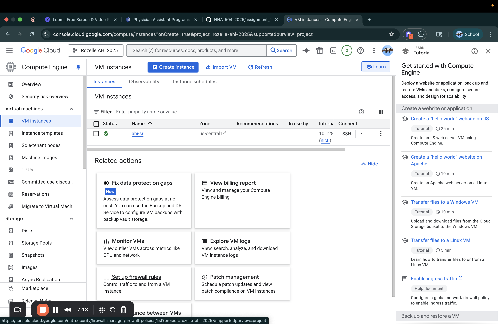
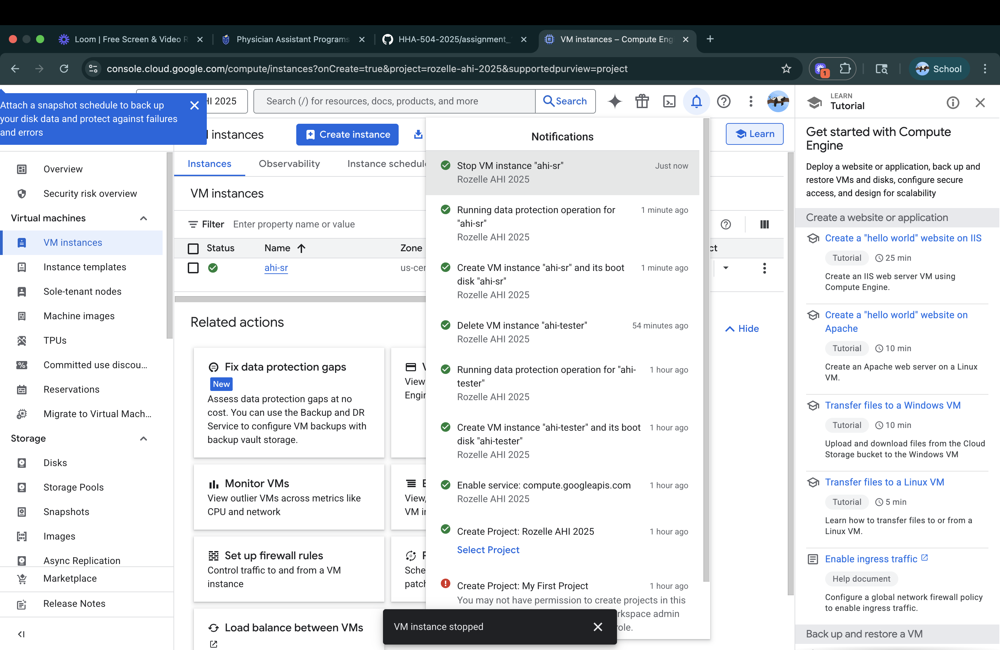
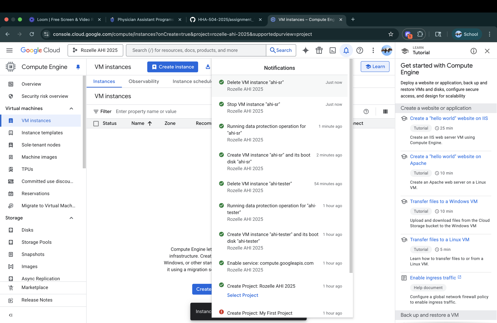
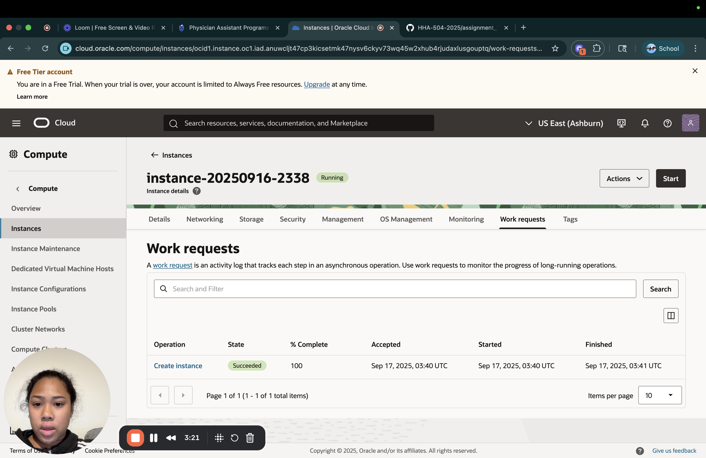
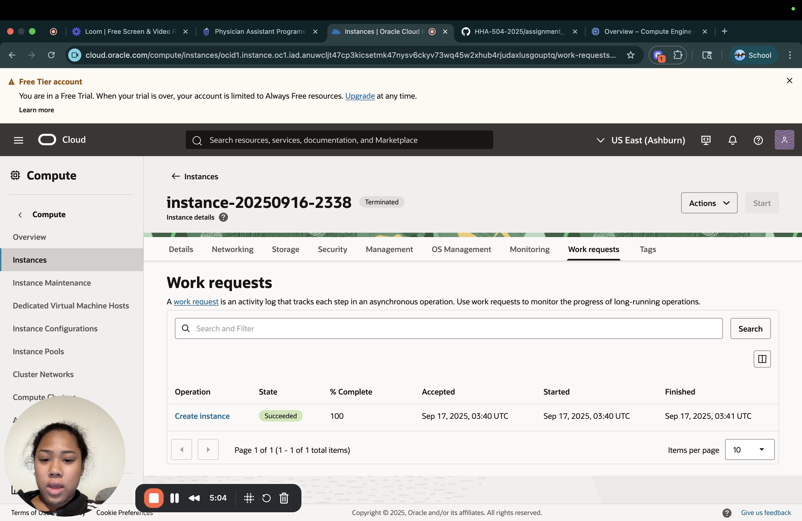

# gcp_oci_vm_start
## Video
Loom/Zoom:https://www.loom.com/share/7076535b972948eabafadb24f43be0c4?sid=61865b20-b045-4dc1-bc38-b303061be763

## Prereqs
- Cloud access to GCP and OCI
- No PHI/PII; smallest/free-tier shapes

## Google Cloud (GCP)
 Create
1. Console → Compute Engine → Create instance
2. Region/zone:
3. Machine type: <smallest available/free-eligible>
4. Image: Ubuntu LTS
5. Boot disk: default minimal
6. Network: default VPC; ephemeral public IP

## Start/Stop
- Start:
Stop: <state shows TERMINATED/STOPPED>

## Delete
- Delete instance and verify no disks/IPs remain

## Oracle Cloud (OCI)
Create

1. Compartment:
2. Networking: VCN with Internet Connectivity (defaults)
3. Shape: <smallest/free-eligible>
4. Image: Ubuntu (or Oracle Linux)
5. Public IP: ephemeral
6. Boot volume: default minimal

## Start/Stop
- Start:
- Stop:

## Terminate
- Terminate and delete boot volume; verify cleanup

# Reflections

## Similarities
- Both provided OS images (LINUX, UBUNTU)
- Virtual networking
- Pay as you go

## Differences
- GCP is more flexible 
- Seems that OCI is cheaper as far as computing

## Preference (OCI vs GCP) and Why
- I prefer to use GCP, it seemed more straighforward than OCI. OCI was a little confusing. I liked that i had the cost opened the whole time for GCP. GCP ran smoother for me personally. 
